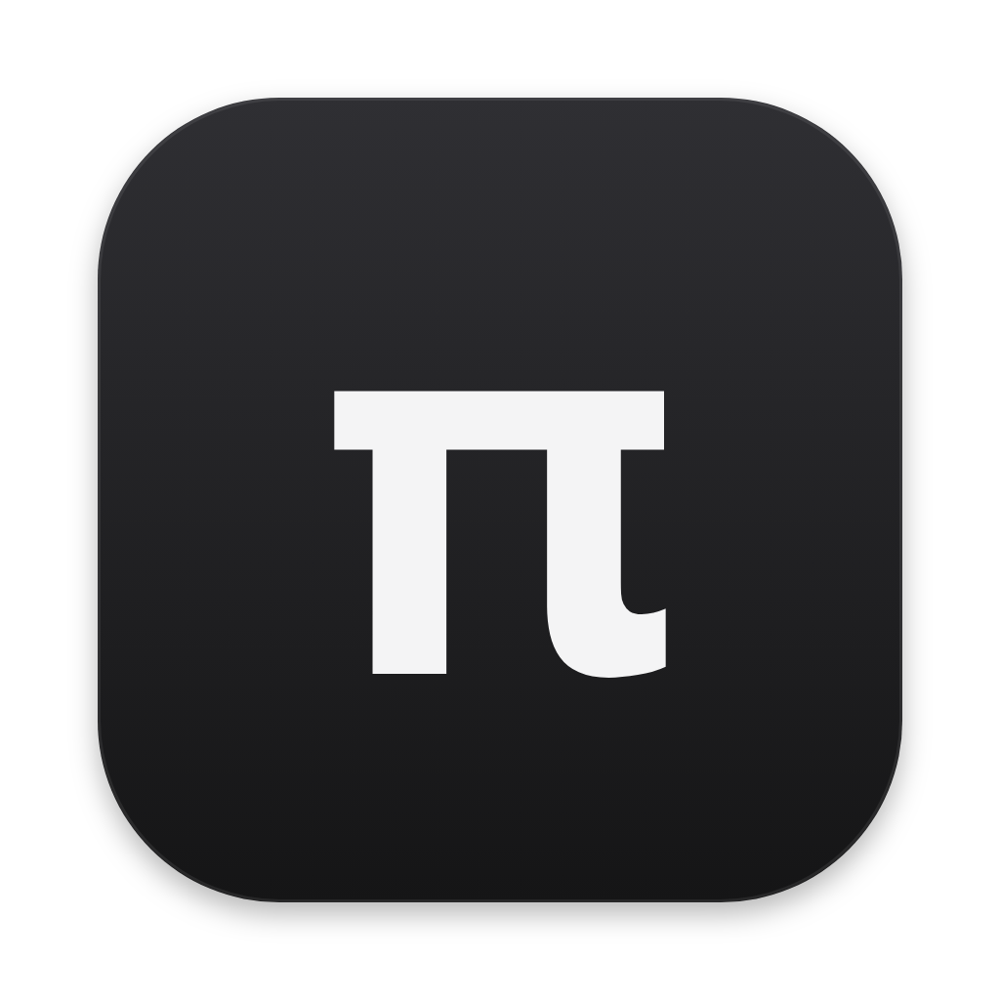

<p align="center">
  
</p>

<h1 align="center">Pi Desktop</h1>

<p align="center">
  A desktop app for <a href="https://github.com/earendil-works/pi">pi</a>, the minimal, extensible AI agent.<br>
  Everything pi can do, in view — and nothing you did not add.
</p>

<p align="center">
  <a href="https://github.com/sedifr/pi-desktop/releases/latest"></a>
  <a href="https://github.com/sedifr/pi-desktop/actions/workflows/ci.yml"></a>
  <a href="./LICENSE"></a>
  
</p>

<p align="center">
  <a href="https://github.com/sedifr/pi-desktop/releases/latest"><b>Download for macOS</b></a> ·
  <a href="docs/guide.md">Guide</a> ·
  <a href="docs/features.md">Features</a> ·
  <a href="docs/design.md">Why it is built this way</a> ·
  <a href="./README.zh-CN.md">简体中文</a>
</p>


Pi Desktop is an unofficial window onto pi. It works on pi's own sessions and settings, so everything is shared with the pi CLI, and it carries its own copy of pi — there is nothing else to install.

pi is small on purpose: four tools, a short prompt, and whatever you choose to add. The app keeps it that way. Every skill, MCP server and tool is a switch you can see, and the interface has no themes and no buttons you did not put there.

## Install

Download the `.dmg` from the [latest release](https://github.com/sedifr/pi-desktop/releases/latest) and drag **Pi Desktop** into Applications. It needs an Apple silicon Mac with macOS 13 or later.

The build is not signed by Apple, so macOS refuses it the first time. Open **System Settings → Privacy & Security** and click **Open Anyway**, or run:

```bash
xattr -dr com.apple.quarantine "/Applications/Pi Desktop.app"
```

Then add a project folder and connect a model in *Settings → Models*. If you already use the pi CLI, your sessions, models, skills and MCP servers are there when it opens. The [guide](docs/guide.md) has the rest.

Rather build it yourself? See [Run from source](#run-from-source).

## What you get

### Assemble each conversation


- **Tiles, not menus** — every skill, MCP server and tool laid out flat, each with one line in your own words.
- **Auto, On, Off** — for this conversation, for a project, or for everything.
- **Leanest** — one click back to pi's four tools.
- **Access levels** — read only, can edit files, full access.
- **Plugins** — browse pi's package catalog, or install from npm, git or a folder.

### Talk to pi

- **Every session, by project** — shared with the CLI; `⌘K` searches everything that was said.
- **See it working** — live thinking, tool output, and a status line that tells thinking from stuck.
- **Steer, queue, edit, regenerate** — replaced turns stay in the session as a branch.
- **`/` commands, `@` files, `!` shell** — and quote an answer to reply point by point.
- **Attach documents** — PDF, Word, PowerPoint and Excel become text before pi reads them.

### Around the conversation

- **Side panel** — the project's files, uncommitted changes, a browser that fits pages to the panel, a terminal.
- **Models and usage** — subscriptions, API keys, compatible endpoints; cost and context at a glance.
- **Also** — a gallery of generated images, a view into sub-agents, several windows, notifications.

### Make it yours

<p>
  
  
</p>

- **Your own buttons** — in six places; a prompt, a skill, a shell command, an app function, or a switch of model.
- **Your own look** — a background image, an accent color, a tint, a palette file, a stylesheet.
- **Hide any part** — and move the conversation list or the icons to the other side.
- **Ask pi** — it is all plain files; pi edits them and the change shows up at once.

Everything, in detail: [docs/features.md](docs/features.md).

## Why it is built this way

A window is where a small agent usually turns into a heavy one. So the app holds to one rule: **it adds nothing to what pi carries, and everything a conversation carries is something you put there, can see, and can take off.** A switch is one of pi's own startup flags, context is spent only where it buys something, and the interface is left to you the way pi leaves the agent to you.

The reasoning, with numbers, is in [docs/design.md](docs/design.md).

## Run from source

You need macOS and Node.js 22.19 or newer.

```bash
git clone https://github.com/sedifr/pi-desktop.git
cd pi-desktop
npm install
npm run build
npx electron .
```

`npm run dev` runs it with hot reload, and `npm run pack` builds `Pi Desktop.app`. [CONTRIBUTING.md](CONTRIBUTING.md) covers the layout of the code, how to test without touching your own pi data, and how a release is made.

## Documentation

- [Guide](docs/guide.md) — first steps, project trust, shortcuts, where things are stored
- [Features](docs/features.md) — everything the app does
- [Design](docs/design.md) — why it is built this way
- [Customizing](resources/customize-guide.md) — the files behind buttons, styles and palettes (the guide pi gets)
- [Changelog](CHANGELOG.md) · [Contributing](CONTRIBUTING.md) · [Security](SECURITY.md)

## Status

Early, and macOS only. Known limits:

- The download is not notarized, so it cannot update itself; *Settings → About → Check for updates* tells you when there is a new release.
- Windows and Linux are untested.
- Built-in parts of the interface can be hidden but not yet moved between places.
- The app speaks pi's protocol only. The ideas are general; an adapter for other agents does not exist.

The interface is available in English and Simplified Chinese.

## License

[MIT](LICENSE). Not affiliated with the authors of pi — which does all the actual work.
