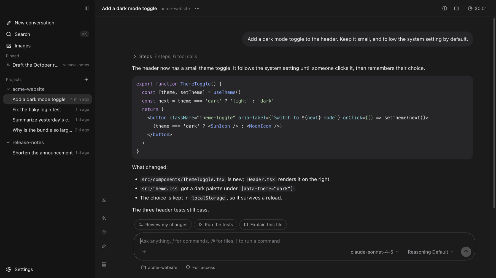
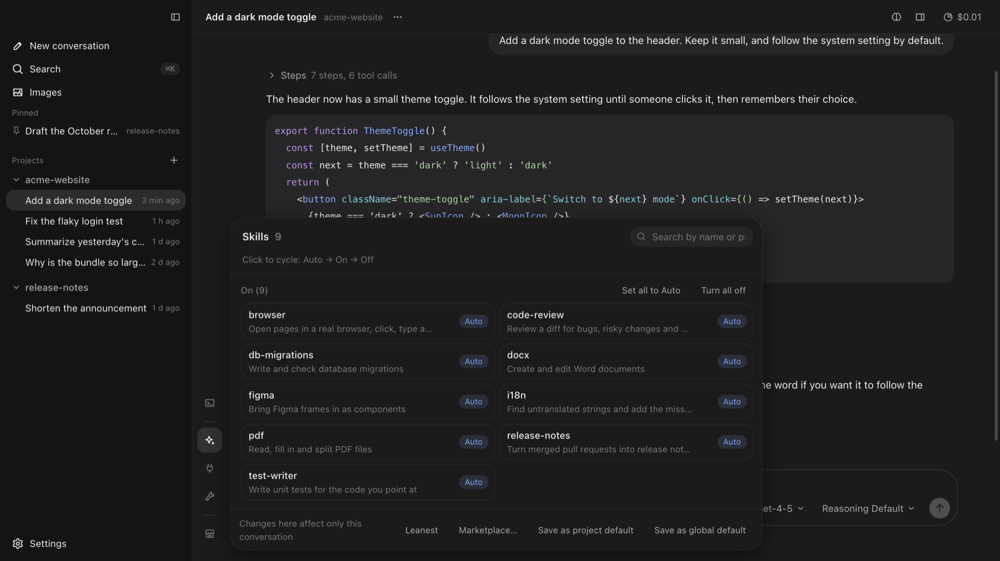
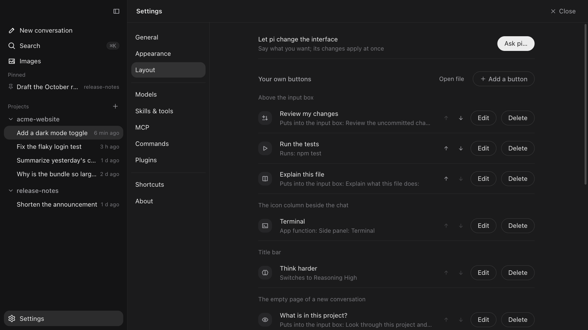
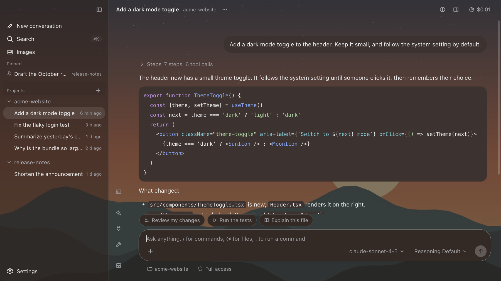

<h1 align="center">Pi Desktop</h1>

<p align="center"><a href="https://github.com/earendil-works/pi">pi 编程 Agent</a> 的非官方桌面端，macOS。</p>

<p align="center">
  <a href="https://github.com/sedifr/pi-desktop/actions/workflows/ci.yml"></a>
  <a href="./LICENSE"></a>
  
</p>

<p align="center"><a href="./README.md">English</a> · <b>简体中文</b></p>



Pi Desktop 给 pi 套了一个窗口。它和 pi 用同一份本地配置和会话文件，所以对话、模型、技能、MCP 服务都和 pi 命令行共用：在一边做的事，另一边马上看得到。应用自带一份 pi，不用另外装任何东西。

pi 有意做得很小，剩下的交给用的人自己定。这个应用对界面也是这个态度：把 pi 能做的事搬到台前，长什么样、哪里放什么由你定。它不带任何预设风格，没有你没放过的按钮，每个部件都能藏起来或挪位置——也可以直接让 pi 帮你改界面。

> **状态**：早期版本。只支持 macOS，在 Apple 芯片上开发。安装包没有 Apple 的签名，第一次打开时 macOS 会拦一下，见[下载安装](#下载安装)。

截图里的界面是英文的；应用有简体中文界面，在「设置 → 通用」里切换。

## 主要功能

**和 pi 对话**

- 本机所有 pi 会话，按项目归类。`⌘K` 按标题和对话里说过的话搜索；对话可以置顶、改名、拖到别的项目。
- 看得见它在干活：思考内容实时滚动，正在跑的工具显示最新输出，底部一行让你分得清是在想还是卡住了。
- 它干活时再发消息可以指挥它；消息可以排队、撤回；发出去的消息可以改了再发，回答可以重新生成。被换掉的那几轮还留在会话文件里，是另一条分支。
- `/` 用指令和技能，`@` 引用文件，`!` 自己运行一条命令。可以引用回答里的几段话逐段回复。能附图片、PDF、Word、PPT 和 Excel。

**决定一次对话带什么**

- 每个技能、MCP 服务、工具都是一张卡片，带一句可以用自己的话改写的简介。可以按对话开关，再存成项目默认或全局默认。
- 「最精简」让对话开场几乎只带 pi 本身，开场上下文很小。
- 一个开关切换「只读」「可改文件」「完全访问」。
- 浏览 pi 的包目录，点一下就装；也可以从 npm、git 或本机文件夹装。
- 订阅账号登录、填 API Key、接兼容的接口。每个提供商前面的圆点显示登录是否还有效。费用、token、缓存命中率、上下文占比点一下就能看。

**对话旁边**

- 右侧面板：项目里的文件、没提交的改动、一个看本机页面的小浏览器、一个终端。
- 所有对话生成过的图片集中在一页；AI 开的子代理有入口可看；可以多开窗口；在后台做完会发通知。

**自己定界面**

- 界面上有六个位置可以放自己的按钮。一个按钮可以是一句常说的话、一条指令或技能、一条直接运行的命令、一个要打开的网页或文件、界面上现成的一个功能，或者一下切换模型、推理档位、权限档位。
- 自己的背景图、强调色和色调；配色文件；CSS 文件。界面上每个部件都能藏起来，对话列表和图标列可以换到右边。
- 按钮、样式、配色都是普通文件，应用盯着它们，所以可以让 pi 来改，改完当场生效。

完整清单见 [docs/features.zh-CN.md](docs/features.zh-CN.md)。

| | |
|---|---|
|  |  |
| 这次对话的技能：自动、开、关 | 自己的按钮，以及哪里显示什么 |



## 开始使用

### 下载安装

到[最新发布](https://github.com/sedifr/pi-desktop/releases/latest)里下载 `Pi Desktop-…-arm64.dmg`，打开后把 **Pi Desktop** 拖进「应用程序」。需要 Apple 芯片的 Mac、macOS 13 或更新，不需要别的：应用自带一份 pi。

安装包没有用 Apple 的开发者证书签名，所以第一次打开时 macOS 会拒绝。两种办法任选一种：

- 打开「系统设置 → 隐私与安全性」，往下翻，点 Pi Desktop 旁边的「仍要打开」（macOS 14 及更早的系统，右键点应用选「打开」也行）；
- 或者在终端里去掉下载标记：`xattr -dr com.apple.quarantine "/Applications/Pi Desktop.app"`。

不想运行别人打包的程序的话，可以从源码运行或者自己打包，做法都在下面。

### 从源码运行

需要 macOS 和 Node.js 22.19 或更新。不用另外安装 pi 命令行。

```bash
git clone https://github.com/sedifr/pi-desktop.git
cd pi-desktop
npm install
npm run build
npx electron .
```

### 打包成应用

```bash
npm run pack
```

会在 `release/mac-arm64/` 里得到 `Pi Desktop.app`。`npm run dist` 另外再出一个 `.dmg` 和一个 `.zip`。

- 应用只做了本机签名（背后没有 Apple 的开发者证书）。在打包它的那台 Mac 上直接能用；拷到别的 Mac 上要先放行一次，做法见[下载安装](#下载安装)。
- 同样的原因，它没法自己更新。「设置 → 关于 → 检查更新」会告诉你有没有新版本，并带你去下载页。
- 项目要是放在 iCloud 云盘同步的文件夹里（桌面和文稿常常是），签名会因为同步加上的文件属性而失败。换个地方打包：`npm run pack -- -c.directories.output=/tmp/pi-desktop-release`。

### 第一次使用

1. **添加项目文件夹。** 点侧栏「项目」旁边的 `+`，选择要让 pi 工作的文件夹。
2. **连接模型。** 打开「设置 → 模型」，选一个提供商，登录或者粘贴 API Key。出现绿点就是可用。
3. **开始对话。** 在底部输入框里打字，按回车发送。Shift+回车换行。
4. **选择技能和工具。** 点聊天区左边那列里的图标（技能、MCP、工具）。改动只影响当前对话，从下一条消息起生效。
5. **把反复要说的话存下来。** 打开「设置 → 快捷指令」，写一次，以后用 `/名字` 调出来；或者在「设置 → 布局」里把它做成一个按钮。

如果你已经在用 pi 命令行，原有的会话、模型、技能和 MCP 服务会直接出现。

### 项目信任

pi 只在你信任一个文件夹之后，才加载它自带的配置（`.pi/skills`、`.pi/prompts`、`.pi/extensions`、`.pi/mcp.json` 等）。项目里有这些文件、又没有存过决定时，输入框上方会出现提示。点「信任并加载」会把决定记到 pi 的 `~/.pi/agent/trust.json`，和命令行用的是同一份。之后可以在标题栏的 `···` 菜单里改。项目里的扩展能在你的电脑上运行代码，所以只信任你清楚来源的项目。

## 自己定界面

决定界面长相的东西，都是 `~/.pi/agent/desktop/` 里的普通文件：

| 文件 | 管什么 |
|---|---|
| `buttons.json` | 自己的按钮：放在哪、叫什么、按下去做什么 |
| `custom.css` | 任何外观上的改动：颜色、字体、间距，把部件藏起来或挪位置 |
| `skins/*.json` | 整套配色，浅色、深色各一版 |

可以在「设置 → 外观」「设置 → 布局」里改，可以手改，也可以直接告诉 pi 想要什么：「设置 → 布局 → 让 Pi 来改」会开一个对话，并把写给 pi 看的说明交给它。应用盯着这些文件，改完当场生效，所有窗口都跟上。文件怎么写，见 [`resources/customize-guide.md`](resources/customize-guide.md)（pi 拿到的就是这一份）。

这些改动不会把界面弄坏：写错的按钮会被跳过并报出来，配色文件只认颜色的写法，挑的颜色太浅太深会自动调到认得清，菜单栏「显示 → 恢复默认外观」一下回到原样。

## 快捷键

| 按键 | 作用 |
|---|---|
| `⌘N` | 新对话 |
| `⌘⇧N` | 新窗口 |
| `⌘O` | 添加项目文件夹 |
| `⌘,` | 设置 |
| `⌘K` | 搜索对话 |
| `⌘F` | 在当前对话里查找 |
| `⌘B` | 显示或隐藏侧栏 |
| `⌥⌘B` | 显示或隐藏右侧面板 |
| `⌘/` | 打开快捷指令 |
| `⌘⇧M` | 切换模型 |
| `⌘⇧C` | 复制上一条回答 |
| `⌘.` 或 `Esc` | 停止正在进行的回答 |
| `Enter` / `⇧Enter` | 发送 / 换行 |
| 开头打 `!` / `!!` | 直接运行命令（输出带给 / 不带给 pi） |
| `⌥Enter` | 正在回答时：等全部做完再处理这条 |

## 数据存在哪

| 内容 | 位置 |
|---|---|
| 会话、登录凭证、模型、技能、MCP 配置 | pi 自己的目录 `~/.pi/agent/` |
| 快捷指令（提示词模板） | `~/.pi/agent/prompts/`，或项目里的 `.pi/prompts/` |
| 项目信任的决定 | `~/.pi/agent/trust.json` |
| MCP 服务 | `~/.pi/agent/mcp.json` |
| 技能、MCP、工具的开关 | `~/.pi/agent/desktop/capabilities.json` |
| 界面上显示的一句话简介 | `~/.pi/agent/desktop/summaries.json` |
| 应用设置 | `~/.pi/agent/desktop/config.json` |
| 只在本应用里加载的扩展 | `~/.pi/agent/desktop/extensions/` |
| 背景图（拷进来的那一份） | `~/.pi/agent/desktop/wallpaper/` |
| 自己的配色文件 | `~/.pi/agent/desktop/skins/*.json` |
| 自己写的样式 | `~/.pi/agent/desktop/custom.css` |
| 自己的按钮 | `~/.pi/agent/desktop/buttons.json` |
| 给 pi 看的「怎么改界面」的说明（每次用到时重新生成） | `~/.pi/agent/desktop/CUSTOMIZE.md` |

应用里的开关不会改 pi 自己的 `settings.json`，所以不影响命令行。登录和添加模型会改 pi 的 `auth.json` 和 `models.json`，因为这两份是共用的。

### 给出图工具的作者

工具结果的 `details.path` 里写着图片存到了哪（`details.prompt` 里可以带上生成要求），「图片」页就能找到这张图。用户指定了统一存图的文件夹时，应用会通过环境变量 `PI_DESKTOP_IMAGE_DIR` 告诉 pi，设置了就请存到那里。

## 工作原理

每个对话背后是一个 `pi --mode rpc` 子进程。应用通过 pi 的 JSON 协议和它通信，并把开关翻译成 pi 的启动参数。登录和模型管理用的是 pi 的 SDK。

应用用 Electron、React 和 TypeScript 写，用 electron-vite 构建。自带的 pi 版本写死在 `package.json` 里。要换成更新的 pi：改版本号，运行 `npm install`，再确认对话还能正常进行。

界面有简体中文和英文两种语言（「设置 → 通用」）。

## 开发

```bash
npm run dev          # 带热更新运行
npm run typecheck    # 类型检查
npm run i18n:check   # 检查每句界面文字都有英文
npm run build        # 构建到 out/
```

源码里的注释和界面文字是用中文写的，英文界面来自 `src/shared/locales/en.ts`。代码怎么组织、怎样测试才不会碰到自己的 pi 数据、项目守着的几条规矩，见 [CONTRIBUTING.md](CONTRIBUTING.md)（英文）。

## 已知限制

- 只支持 macOS，Windows 和 Linux 没有测过。
- 打包出来的应用没有经过 Apple 公证，所以不能自己更新，在别人的 Mac 上第一次打开要确认一下。
- 按对话开关 MCP 服务依赖 `pi-mcp-adapter` 扩展，它会把所有工具的说明提前交给模型，所以每次对话都占 token。pi 自带的 MCP 用到时才找工具，几乎不占，但服务对所有对话都一样。
- 在某次对话里关掉一个扩展时，pi 会带着应用认得的那些扩展重新启动。只写在项目 `.pi/settings.json` 里的包，这种情况下不会被带上。
- 远程 MCP 服务的登录用的是 pi 自带的 MCP。需要预先注册登录客户端的服务，要手动在 `mcp.json` 里配。
- 界面上自带的部件可以藏起来，但还不能在几个位置之间挪；要加全新的面板得改源码。

## 参与

欢迎提问题和合并请求，见 [CONTRIBUTING.md](CONTRIBUTING.md)。安全问题见 [SECURITY.md](SECURITY.md)。每个版本改了什么见 [CHANGELOG.md](CHANGELOG.md)。

## 许可证

[MIT](LICENSE)。本项目和 pi 的作者没有关联。真正干活的是 [pi](https://github.com/earendil-works/pi)，这个应用只是它的一个窗口。
